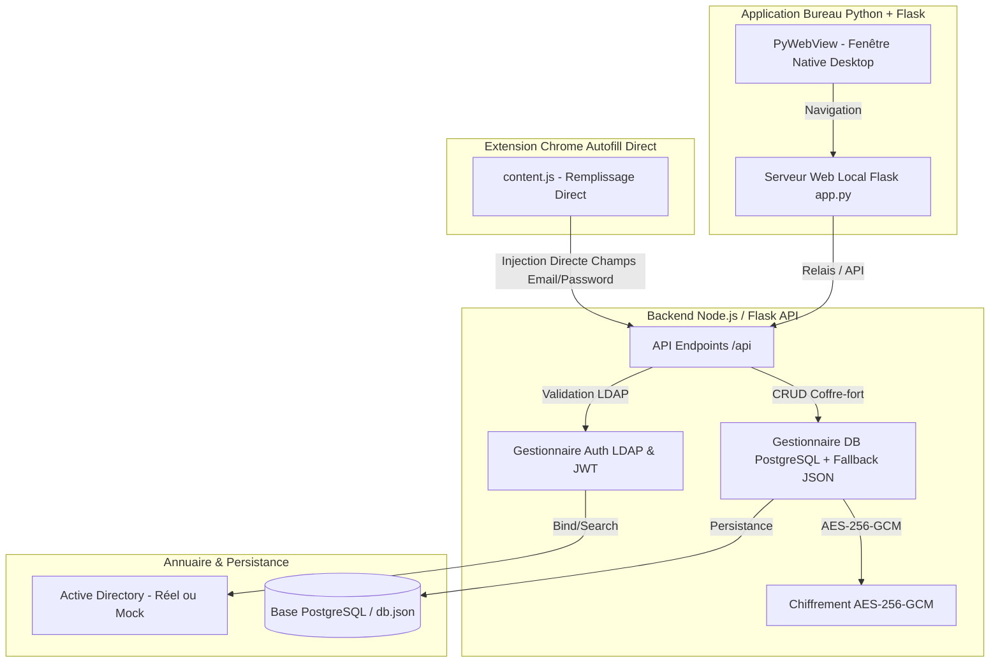

# SecurPass - Application Desktop Python + Flask & Extension Chrome (DirectFill)

SecurPass est une application de gestion de mots de passe d'entreprise, dotée d'une **application Desktop native Python + Flask**, d'une extension Chrome de **remplissage automatique direct**, et d'une intégration **Active Directory / LDAP** sécurisée par le chiffrement fort AES-256-GCM.

---

## 📸 Architecture Globale



---

## 🚀 Démarrage Rapide

### 1. Démarrer l'Application Desktop Python + Flask
Double-cliquez sur `start-desktop.bat` ou exécutez :
```bash
python app.py
```
> Une fenêtre bureau native SecurPass s'ouvrira automatiquement sur votre système.

### 2. Extension Chrome (DirectFill)
1. Ouvrez Chrome et accédez à `chrome://extensions/`.
2. Activez le **Mode développeur** en haut à droite.
3. Cliquez sur **Charger l'extension non empaquetée** et sélectionnez le dossier `chrome-extension/`.
4. Naviguez sur n'importe quel site enregistré dans votre coffre-fort (ex: `http://localhost:5000/mock-target.html`) : l'extension pré-remplit **directement** votre e-mail/identifiant et votre mot de passe dans les champs sans nécessiter de validation manuelle !

---

## 📂 Structure du Projet

```text
projet_stage/
├── app.py                             # Application Desktop Python + Flask avec PyWebView
├── requirements.txt                   # Dépendances Python (flask, pywebview, cryptography, pyjwt)
├── start-desktop.bat                  # Script de lancement Desktop sous Windows
├── start-server.bat                   # Script de démarrage du serveur Backend
│
├── backend/
│   ├── data/
│   │   └── db.json                    # Base de données JSON locale (fallback automatique)
│   ├── src/
│   │   ├── crypto.js                  # Module de chiffrement AES-256-GCM
│   │   ├── db.js                      # Gestionnaire DB (PostgreSQL + Fallback JSON)
│   │   ├── ldap.js                    # Authentification & gestion Active Directory
│   │   ├── routes.js                  # Endpoints d'API (/api/auth, /api/vault, /api/admin)
│   │   └── server.js                  # Serveur HTTP Express & static files
│   └── .env                           # Configuration de l'environnement
│
├── chrome-extension/
│   ├── content.js                     # Script de remplissage automatique direct (AutoFill Direct)
│   ├── manifest.json                  # Manifest Manifest V3
│   ├── popup.html / popup.js          # Interface popup de l'extension
│   └── popup.css                      # Styles du popup
│
└── frontend/
    ├── app.js                         # Interface client interactive
    ├── index.html                     # Application Web SPA (Single Page Application)
    ├── mock-target.html               # Page intranet de démonstration pour le remplissage direct
    └── style.css                      # Thème CSS Glassmorphism & Animations
```

---

## 🔐 Identifiants de Démonstration (LDAP_MOCK=true)

- **Administrateur** : `admin` / `Admin@2026!`
- **Administrateur** : `administrateur` / `Admin@2026!`
- **Utilisateur Standard** : `user` / `User@2026!`


---

## 🛡️ Guide Complet & Durcissement de la Sécurité

Pour consulter les instructions détaillées de démarrage et la liste complète des recommandations de sécurité pour le passage en production (migration de **LDAP** à **LDAPS**, HTTPS, gestion des clés de chiffrement, durcissement PostgreSQL, etc.), consultez le guide dédié :

👉 **[GUIDE_DEMARRAGE_ET_RECOMMANDATIONS_SECURITE.md](file:///c:/Users/Dell/Desktop/projet_stage/GUIDE_DEMARRAGE_ET_RECOMMANDATIONS_SECURITE.md)**

